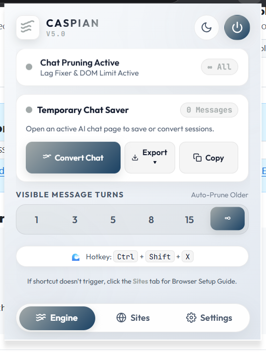
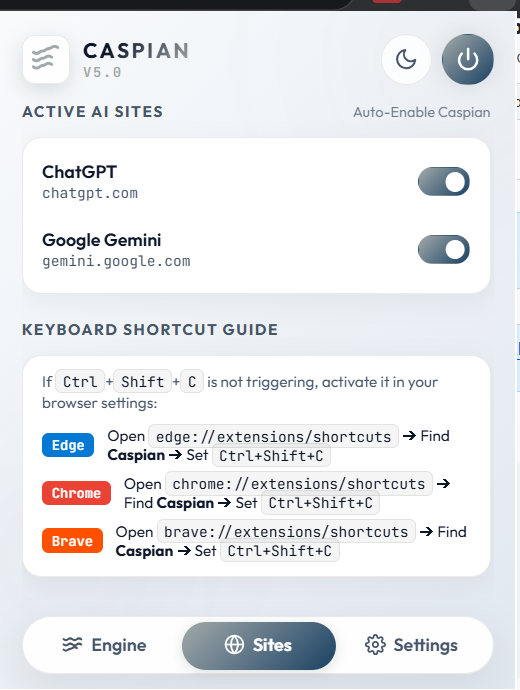
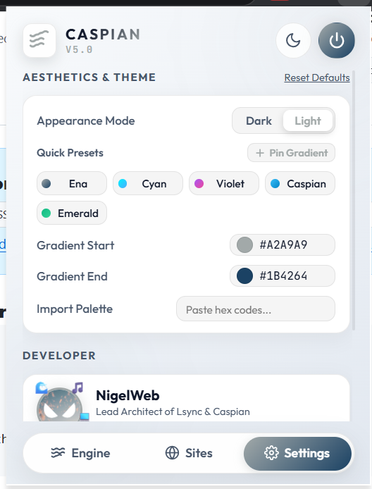
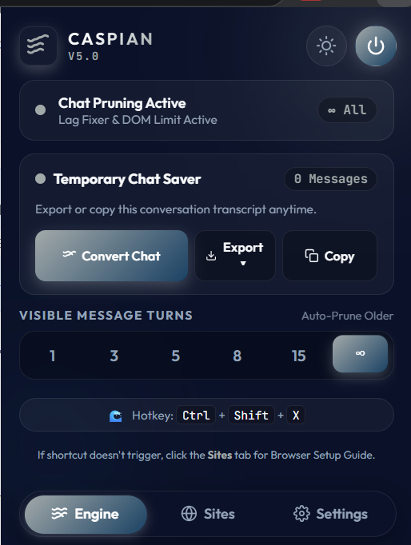

# 🌊 Caspian - AI Chat Pruner & Temporary Chat Vault

> **Lag-free DOM pruner, temporary chat converter, multi-format exporter, and aesthetic UI control center for ChatGPT and Google Gemini.**

---

## 📸 Interface Showcase

| Engine Control Center | Site Access & Shortcut Guide |
| :---: | :---: |
|  |  |

| Theme & Aesthetics Manager | Dark Appearance Mode |
| :---: | :---: |
|  |  |

> 💡 **Dev Recommendation:** *While Dark Mode is fully supported, we recommend using **Light Mode** as Caspian's signature gradient and glassmorphism look exceptionally crisp and vibrant in Light Mode!*

---

## 🌟 Overview & How It Works

### 🚀 DOM Pruning (Lag Fixer)
When engaging in long conversation threads on **ChatGPT** or **Google Gemini**, browsers slow down and introduce typing latency due to thousands of rendered DOM elements. 
**Caspian** dynamically prunes older conversation turns from the active browser viewport using high-performance CSS (`display: none !important`). This eliminates typing lag while retaining 100% of your chat history in memory.

### 🛡️ Temporary Chat Vault & Exporter
**Temporary Chats** in AI tools disappear forever once closed, risking data loss when a quick session evolves into an important conversation. 
Caspian automatically detects active temporary chat sessions, letting you convert them into permanent saved chats or export them into multiple formats.

---

## ✨ Key Features & Capabilities

- 🚀 **Temporary Chat Converter**:
  - **Convert to Permanent Saved Chat**: Extracts full conversation history from a temporary session, opens a new normal session, and injects the transcript so your AI provider saves it to your account history.
  - 📋 **1-Click Copy**: Copies structured Markdown transcripts directly to your clipboard.
- 📥 **Multi-Format Export Suite**:
  - 📄 **Markdown (`.md`)**: Formatted Markdown file with user prompts, AI responses, and fenced code blocks.
  - 📝 **Plain Text (`.txt`)**: Clean formatted transcript log.
  - 📕 **Document PDF (`.pdf`)**: Styled document with **KaTeX LaTeX math rendering** for math formulas and equations.
  - 📸 **Full Page Print PDF**: 1-click unhide and native webpage print preview.
- ⚡ **Message Turn Limit Selection**: Choose visible turn limits: `1`, `3`, `5`, `8`, `15`, or `∞ Unlimited`.
- 🌐 **Supported Sites**:
  - **ChatGPT** (`chatgpt.com`) — Auto-enabled.
  - **Google Gemini** (`gemini.google.com`) — Auto-enabled.
  - Per-site toggles available in the **Sites** tab.
- 🎨 **Aesthetics & Custom Gradient Engine**:
  - Default **Caspian** gradient palette (`#A2A9A9` to `#1B4264`).
  - Dual custom hex color pickers & smart palette importer.
  - **Quick Preset Pinning System**: Pin your favorite gradient combinations directly to your dashboard.
- 👨‍💻 **Developer Profile & Facts**: Integrated NigelWeb profile card with interactive facts.

---

## 🔒 Privacy & Security Guarantee

- 🛡️ **100% Local Execution**: Caspian operates entirely within your browser's local sandbox using Chrome Local Storage.
- 🚫 **Zero Data Collection**: We **DO NOT** track, record, collect, or transmit any user prompts, personal data, or conversation transcripts.
- 🌐 **No Remote Servers**: Caspian makes **zero external API calls** to third-party servers. Your data stays 100% on your device.

---

## ⚠️ Work In Progress (Known Limitations)

> [!NOTE]
> - **ChatGPT**: The **Convert Chat** auto-prompt injection works seamlessly out of the box.
> - **Google Gemini (WIP)**: Due to Gemini's complex Angular `<rich-textarea>` component architecture, automatic prompt text injection on new Gemini tabs is currently a **Work In Progress (WIP)**. 
>   - *Workaround for Gemini*: Click **Copy** (or **Export**) in the Caspian popup, open a new Gemini chat, and press <kbd>Ctrl</kbd> + <kbd>V</kbd> to paste the context manually!

---

## ⌨️ Keyboard Shortcuts

| Action | Shortcut Command |
| :--- | :--- |
| **Toggle Chat Pruning** | <kbd>Ctrl</kbd> + <kbd>Shift</kbd> + <kbd>X</kbd> *(or <kbd>Ctrl</kbd> + <kbd>Shift</kbd> + <kbd>C</kbd>)* |

> 🔧 **Browser Shortcut Setup Guide**:
> If the hotkey does not trigger immediately in your browser, configure it under your browser extensions shortcuts page:
> - **Chrome**: `chrome://extensions/shortcuts`
> - **Edge**: `edge://extensions/shortcuts`
> - **Brave**: `brave://extensions/shortcuts`

---

## 📥 Installation Guide

1. **Download/Clone the Repository**:
   ```bash
   git clone https://github.com/code4nigel/Caspian.git
   ```
2. Open your browser and navigate to the extensions page:
   - **Chrome**: `chrome://extensions`
   - **Edge**: `edge://extensions`
   - **Brave**: `brave://extensions`
3. Enable **Developer Mode** using the toggle switch in the top-right corner.
4. Click **Load unpacked**.
5. Select the [`Caspian`](Caspian) directory from this project folder.
6. Open [ChatGPT](https://chatgpt.com) or [Google Gemini](https://gemini.google.com) and click the **Caspian** sea wave icon!

---

## 📁 Project Repository Structure

```
Caspian/
├── README.md               # Complete documentation & user guide
├── LICENSE                 # GNU General Public License v3.0 (GNU GPLv3)
└── Caspian/                # Chrome / Chromium Extension Directory
    ├── manifest.json       # Extension Manifest V3 configuration
    ├── background.js       # Background service worker
    ├── content.js          # DOM observer, lag fixer, text extractor & restorer
    ├── popup.html          # Glassmorphic control panel interface
    ├── popup.css           # Design system tokens, glassmorphism & themes
    ├── popup.js            # Storage sync, multi-format exporter & preset manager
    ├── developer.png       # NigelWeb developer avatar
    ├── icon16.png          # Caspian wave toolbar icon (16x16)
    ├── icon48.png          # Caspian wave toolbar icon (48x48)
    ├── icon128.png         # Caspian wave toolbar icon (128x128)
    └── images/             # Documentation screenshots
        ├── caspian_mainUI.png
        ├── caspian_siteUI.png
        ├── caspian_settingsUI.png
        └── Caspian_darkUI.png
```

---

## 👨‍💻 Author

Created with ❤️ by **NigelWeb** ([github.com/code4nigel](https://github.com/code4nigel))  
*Lead Architect of Lsync, Caspian, and Scrobby.*

---

## 📄 License & Copyleft Guarantee

Distributed under the **GNU General Public License v3.0 (GNU GPLv3)**.  
*This software is free, copyleft, and open-source forever. Anyone is free to inspect, modify, and redistribute it under the condition that all derivative works remain free, open-source, and credit the original author (**NigelWeb**). Commercial reselling without attribution or locking down the source code is strictly prohibited by law.*

See [`LICENSE`](LICENSE) for full license details.
