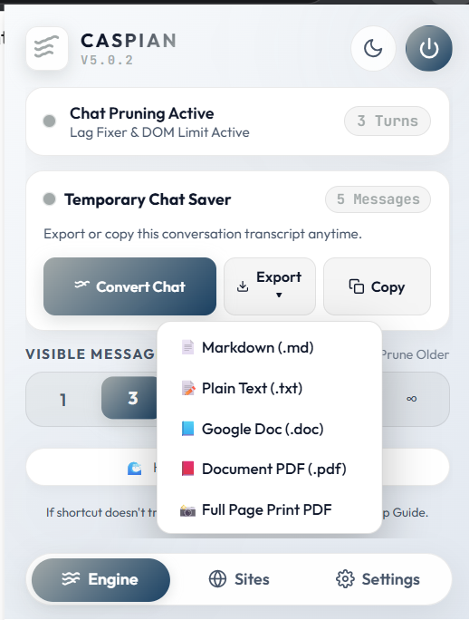

# Caspian: AI Chat Pruner, Universal Media Speed Engine & Productivity Suite

Caspian is a lightweight, privacy-focused productivity tool available as a Chromium desktop extension and native Android companion applications (Caspian Flow & Caspian Mobile).

It addresses everyday web performance and workflow friction: eliminating typing lag in long AI conversations via real-time DOM pruning, providing universal playback speed control across all media sites, cleaning up your YouTube homepage with quick feed limits and 1-click "Not interested" actions, converting temporary chats to permanent history, and exporting conversation transcripts to clean, publication-ready formats.

---

## Platforms & Ecosystem

| Desktop Extension (Chromium) | Caspian Flow / Mobile (Android) | Automatic Updates (Obtainium) |
| :--- | :--- | :--- |
| Universal Chromium Extension (V6.1.5) | Floating Action Pod & Bottom Sheet UI | One-click app updates via GitHub Releases |
| ChatGPT, Google Gemini, YouTube, Media | Omnibox Multi-Tab Browser & AI Docks | Import configuration file included in repo |
| DOM Pruner, Flow Speed, Exporters & Themes | Zero-Lag DOM Pruning & Video Remote | Background update notifications & installs |

---

## Caspian Flow Mobile Interface Showcase

  
  
  

  
  
  

---

## Caspian Desktop Extension Showcase

  
  

  
  
  

---

## Desktop Extension Highlights (V6.1.5)

### 1. Real-Time AI Chat DOM Pruning
Long conversation threads on ChatGPT and Google Gemini often introduce severe typing latency, frame drops, and browser memory bloat due to thousands of rendered DOM elements. Caspian dynamically virtualizes offscreen conversation messages from the active viewport using lightweight CSS rules. Typing lag is eliminated immediately while 100% of your chat history remains intact in memory.

### 2. Flow Speed: Universal Media Playback Controller
A clean, system-wide media rate controller that works on `<video>` and `<audio>` elements across any website (YouTube, Netflix, Twitch, Coursera, Udemy, Vimeo, and embedded players):
- **Precision Speed Control**: Adjust playback speed continuously from `0.25x` to `5.0x` or use instant preset pills.
- **Smart A/B Toggle (<kbd>Alt</kbd> + <kbd>S</kbd>)**: Switches between `1.00x` and your last active custom speed (e.g. `1.75x`) with a single keypress.
- **Speed Cycle (<kbd>Alt</kbd> + <kbd>D</kbd>)**: Rotates through a customizable comma-separated list of speeds (e.g. `1, 1.25, 1.5, 1.75, 2, 2.5, 3`).
- **Fine Adjustment (<kbd>]</kbd> / <kbd>[</kbd>)**: Step up or down by `0.25x`.
- **Left-Side Speed HUD**: A floating glassmorphic badge with a wave indicator appears on screen when shortcuts are pressed.
- **Toolbar Icon Speed Badge**: Live speed badge on the extension icon with an ON/OFF toggle in settings.
- **Input Protection**: Automatically disables shortcuts when typing inside search inputs, comment boxes, or editors.

### 3. YouTube Home Feed Cleaner & Instant Feedback
- **Feed Limit Control**: Limit the number of videos displayed on your YouTube homepage (in neat multiples of 3: `3`, `6`, `9`, `12`, `15`, `18`, `21`, `24`, `30`, or `∞ All`).
- **1-Click "Not Interested" Button**: Hovering over any video thumbnail reveals an instant "Not interested" button at the top-left, automatically triggering YouTube's native feedback menu without requiring extra clicks.

### 4. Universal Transcript Exporter
Export both normal and temporary conversations from ChatGPT and Google Gemini into five clean formats:
- **Styled PDF / HTML**: Formatted document with KaTeX LaTeX math equations, language-tagged syntax-highlighted code blocks, tables, and conversation badges.
- **Markdown (`.md`)**: Full Markdown transcripts with headers and code fences.
- **Plain Text (`.txt`)**: Clean structured plain text logs.
- **Microsoft Word / Google Docs (`.doc`)**: Editable structured document outlines.
- **Clipboard Copy**: Instant 1-click transcript copying.

### 5. Temporary Chat Vault
Detects active temporary or guest chat sessions in ChatGPT and Gemini, allowing you to convert them into permanent account history before they disappear.

### 6. Settings Backup & Migration (JSON Import / Export)
Easily backup all your theme accents, chat limits, YouTube preferences, and Flow Speed hotkeys to a `.json` file, and restore them instantly on another browser or device.

---

## Desktop Extension Installation

### Supported Browsers
- Google Chrome, Microsoft Edge, Brave, Opera, Vivaldi, Arc, and other Chromium-based browsers.

### Installation Steps
1. Download the latest release archive (`Caspian-Extension-v6.1.5.zip`) from the [GitHub Releases Page](https://github.com/code4nigel/Caspian/releases).
2. Unzip the downloaded file to a local folder.
3. Open your browser and go to the extensions management page:
   - **Chrome**: `chrome://extensions`
   - **Edge**: `edge://extensions`
   - **Brave**: `brave://extensions`
4. Enable **Developer mode** (toggle in the top-right corner).
5. Click **Load unpacked** and select the unzipped `Caspian` folder.
6. Pin Caspian to your toolbar for quick access.

---

## Caspian Flow and Caspian Mobile (Android)

### Mobile Highlights
- **Integrated Service Hub**: Switch seamlessly between ChatGPT, Google Gemini, Google Search, and YouTube.
- **Floating Docks**:
  - **ChatGPT & Gemini Docks**: Reload triggers, turn navigators, and pruning limits.
  - **YouTube Floating Remote**: Custom glass dropdowns for playback speed (`0.25x` to `2.0x`) and video quality.
  - **Google Search Dock**: Quick query switcher and one-tap page scrolling.
- **Touch-Draggable Action Pod**: Customizable trigger button positionable anywhere on screen.
- **In-App Auto-Updater**: Direct GitHub releases query, changelog viewer, and 1-tap in-app APK installer without external tools.
- **Dynamic App Launcher Icons**: Choose between 5 custom app icon themes (Classic, Cyber Cyan, Gold Shimmer, Midnight Violet, Matrix Emerald).
- **Omnibox Browser**: Integrated URL bar with tab switching, privacy controls, and clipboard search previews.

### APK Installation
1. Download the latest `.apk` from [GitHub Releases](https://github.com/code4nigel/Caspian/releases):
   - **Caspian Flow (Beta C)**: `Caspian-Flow-v1.1.35-BetaC.apk`
   - **Caspian Mobile (Stable)**: `Caspian-Mobile-v1.2.40.apk`
   - **Caspian Beta A (Experimental)**: `Caspian-Beta-A-v1.2.48.apk`
2. Open the file on your Android device (Android 7.0+).
3. Allow installation from unknown sources if prompted.

---

## Automatic Updates via Obtainium

You can use [Obtainium](https://github.com/ImranR98/Obtainium) to receive automatic background update notifications and install releases directly from GitHub.

### 1-Click Setup with Configuration File
1. Install **Obtainium** from the [official repository](https://github.com/ImranR98/Obtainium).
2. Download the pre-configured setup file: [`obtanium setup/Caspian_Obtainium_Setup_V2.json`](obtanium%20setup/Caspian_Obtainium_Setup_V2.json).
3. In Obtainium, go to **Settings** ➔ **Import/Export** ➔ **Import configuration**.
4. Select the file to automatically configure all three Caspian app tracks.

---

## Privacy & Security

- **100% Local Execution**: Caspian runs entirely inside your browser's local sandbox and Android app runtime.
- **Zero Data Collection**: No prompts, chat logs, account credentials, or telemetry data are collected or transmitted.
- **No External Tracking**: Caspian makes no third-party network requests.

---

## License

- **Author**: Copyright © 2026 **NigelWeb** ([github.com/code4nigel](https://github.com/code4nigel))
- **Repository**: [https://github.com/code4nigel/Caspian](https://github.com/code4nigel/Caspian)
- **License**: [GNU General Public License v3.0 (GPL-3.0)](LICENSE)

---

  Built with 💗 by <a href="https://github.com/code4nigel">code4nigel</a>

